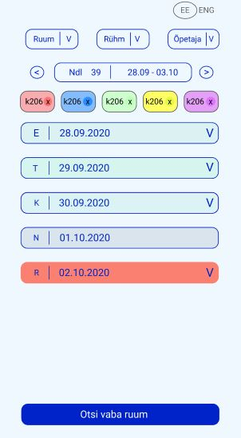

# Projekt "TUNNIPLAAN"
## 1. Meeskond
 - Martin Trumann
 - Joonas Püüding
 - Siiri Selberg
 - **Priit Puppart**
 - Johanna Avik
 - Daniel Nõukas

 ## 2. Projekti eesmärk
 - Töötav prototüüp figmas
 - Leht peab töötama ka mobiilis - responsive
 - Projekt Githubis
 - Kõik tegevused peavad olema issuedena dokumenteeritud
 - Kood peab olema Githubis
 - Valmis töö Zone serveris
- Kasuta projekti läbiviimisel scrumi


## 3. Projekti kulg
### Esimene päev
1. Ülesannete jagamine team´i liikmete vahel
2. Kontode loomine ja sidumine kasutajatega – github ja figma keskkonnas
3. Esmase tooteplaani paika panemine
4. Algse toote väljamõtlemine ja visualiseerimine
5. Tootele funktsionaalsuse lisamine

### Teine päev
1. Toote “puhtam” ümberjoonistamine 
2. Toote näitamine kasutajatele
3. Toote kujundamine Figmas
4. Protsesside ja funktionaalsuse täiendav kontroll
5. Toote edasikujundamine Figmas (täiendavad vaated)
6. Koodi kirjutamine…

### Kolmas päev
1. Koodi kirjutamine
2. Toote testimine 
3. Parandused 
4. Toote esitlemine


## 4. Minu roll tiimis
- Tutvuda meeskomnnaga  
- Jagada tööülesanded laiali
- Esmase toote prototüübi loomine
- Protsessi jälgimine
- Paranduste tegemine
- Toote esitlemine kliendile   


## Viited tehtud tööle

Toote disaini vaatamiseks palun kliki: 
[Figma](https://www.figma.com/file/6beOOX3ySEW4ofg8Fmeq0I/Untitled?node-id=5%3A60)


#### Mobiilivaate kujundus



## Kood

```python
print "<!DOCTYPE html>
<html lang="en">

<head>
    <meta charset="UTF-8">
    <meta name="viewport" content="width=device-width, initial-scale=1.0">
    <title>Document</title>
    <link rel="stylesheet" href="style.css">
</head>

<body>
	<div style="margin: 0.5rem">
		<div class="lang">
			<div>
				<a href="?lang=ee">EE</a>
			</div>
			<div>
				<a href="?lang=en">EN</a>
			</div>
		</div>
		<div class="filters">
			<a href="selectmodal.html">
				<span>Ruum ▼</span>
			</a>
			<a href="selectmodal.html">
				<span>Rühm ▼</span>
			</a>
			<a href="selectmodal.html">
				<span>Õpetaja ▼</span>
			</a>
		</div>

		<div class="filters">
			<span class="arrow">◀</span>
			<div>
				<span>ndl 39 |</span>
				<span>28.09 - 02.10</span>
			</div>
			<span class="arrow">▶</span>
		</div>

		<div class="selections">
			<div style="background-color: hsl(0, 100%, 80%)">
				<span id="slection1">TAK-18</span>
				<span class="close">x</span>
			</div>
			<div style="background-color: hsl(212, 100%, 80%)">
				<span id="slection2">TAK-19</span>
				<span class="close">x</span>
			</div>
			<div style="background-color: hsl(120, 100%, 90%)">
				<span id="slection3">TAK-20</span>
				<span class="close">x</span>
			</div>
			<div style="background-color: hsl(60, 100%, 90%)">
				<span id="slection4">TA-19</span>
				<span class="close">x</span>
			</div>
			<div style="background-color: #DE73FF">
				<span id="slection5">TA-20</span>
				<span class="close">x</span>
			</div>
		</div>

		<div class="days">
			<a href="day.html">
				<div class="start">
					<span>E</span>
					<span>|</span>
					<span>28.09.2020</span>
				</div>
				<span class="open">▼</span>
			</a>
			<a href="day.html">
				<div class="start">
					<span>T</span>
					<span>|</span>
					<span>29.09.2020</span>
				</div>
				<span class="open">▼</span>
			</a>
			<a href="day.html">
				<div class="start">
					<span>K</span>
					<span>|</span>
					<span>30.09.2020</span>
				</div>
				<span class="open">▼</span>
			</a>
			<a class="empty">
				<div class="start">
					<span>N</span>
					<span>|</span>
					<span>01.10.2020</span>
				</div>
				<span></span>
			</a>
			<a href="day.html" class="today">
				<div class="start">
					<span>R</span>
					<span>|</span>
					<span>01.10.2020</span>
				</div>
				<span class="open">▼</span>
			</a>
		</div>
	</div>
	<div class="freeRooms" style="margin: 0.5rem">
		<a href="freeRooms.html">Vabad Toad</a>
	</div>
</body>

</html>"
```


> Komisjon: _"Toode on huvitav, mistõttu osa loodud funktsonaalsusest tahaks ka päriselus kasutada"_


